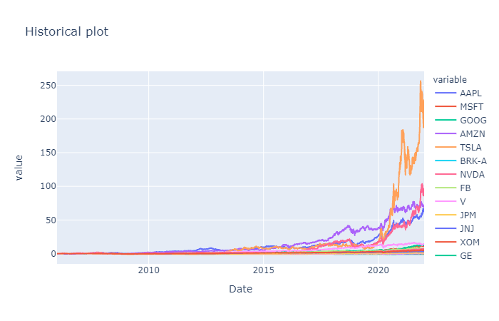
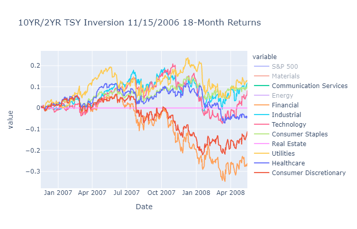
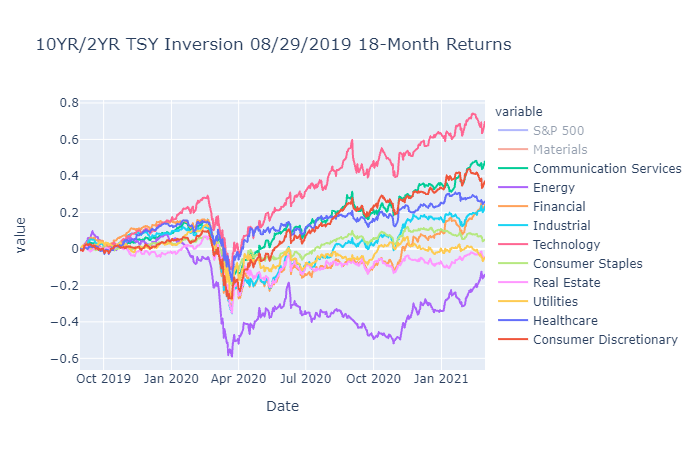

# Discover Stocks

## Project Background

Summarize the top 10 companies by year in terms of market capitalization for the last 15 years to uncover marketplace trends and create a dynamic dashboard for additional analysis. Of those top companies year-over-year, which had the strongest performance over that same time period. Discover which sectors performed best after recession leading indicators (yield curve inversion) for 6, 12, and 18 month intervals. 

By conducting this analysis we hope to illustrate marketplace trends and further direct attention to certain macroeconomic signals that could potentially have a significant effect on our markets in the next 18-24 months.


## Project Description

1)  Our group first obtained data pertaining to the market capitalization for the top 10 companies each year dating back to 2006.
    * Compiled this data manually and stored in a csv file
    * Listed the top 10 companies each year
    * Displayed overall growth in terms of market capitlization across the dataset to identify companies that have become more prevalent and dominant factors in the current marketplace



2)  After identifying those high profile companies from the last 15 years, our group wanted to demonstrate performance over that same time period in hopes of uncovering additional trends.
    *   Through the use of the yfinance API we were able to compile a dataset that stored the percent change in terms of stock price to identify the top performing companies each year
        *   '08-09' Recession Impacts
        *   COVID-19 Market Pullback
        *   From 2006-2021 we see the continued fast paced growth of tech and tech related stocks
            * Tesla
            * Amazon
            * Facebook (Meta)
            * Nvidia

3)  Next, our group wanted to touch on an interesting phenomenan that is revelant to the current market landscape: yield curve inversion.
    * The yield curve has inverted before every recession that has taken place since the 1970s.
    * Historical analysis comparing the 10YR/2YR  and 10YR/3mo inversions over the last 15 years and subsequent performance of S&P 500 sectors.
    * Last 10YR/2YR inversion took place April 1st, 2022.







4) Last but not least... Data Collection and Cleansing
    * Keep the data collection limited but still gain insight at a macro level. We did this my limiting the analysis of the companies to top 10 by market cap for the years 2006 – 2021. This way we would cover the past losers & the recent winners as well.
    * We used yfinance to primarily source all this data. To avoid the lack of data of non-US equities we decided to stick only to the US based companies. 
    * Since this is a stale data, we wanted to avoid downloading this data repeatedly & stored it in a csv which was then used for the subsequent analysis..
    * This being a large time period, we had to deal with lack of data for recently IPOd companies. We used fillna(method='backfill’) to make sure the pct_change() values are sane for the missing data.


## Collaborators
* Kamalnivas Balasubramanian
* John Ryan
* Alyssa Younger
* Patricia Rajamanickam


## Installation Guide
- ### Must have Anaconda base ###
```
conda activate base
conda create -n pyvizenv python=3.7 -y
conda activate pyvizenv
conda install -c conda-forge python-dotenv -y
conda install -c anaconda nb_conda -y
conda install -c conda-forge nodejs=12 -y
conda install -c pyviz holoviz -y
conda install -c plotly plotly -y
conda install -c conda-forge jupyterlab=2.2 -y
conda install -c anaconda numpy==1.19 -y
conda install -c conda-forge matplotlib==3.0.3 -y
conda install -c conda-forge yfinance -y
conda install -c anaconda pathlib -y
jupyter labextension install @jupyter-widgets/jupyterlab-manager --no-build
jupyter labextension install jupyterlab-plotly --no-build
jupyter labextension install plotlywidget --no-build
jupyter labextension install @pyviz/jupyterlab_pyviz --no-build
jupyter lab build 

```
